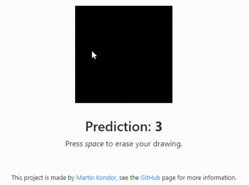

<p align="center"></p>

# DigitRecognizer

[](https://github.com/MartinKondor/DigitRecognizer/)
[](https://github.com/MartinKondor/DigitRecognizer/)
[](https://github.com/MartinKondor/DigitRecognizer/issues)

[](https://opensource.org/licenses/MIT)

Handwritten digit recognizer AI.

## Getting Started

### Prerequisites

* Python 3.8+
* Anaconda 4.13+ (optional)
* Python modules from the `requirements.txt`

### Deployment

Dowload and install the dependencies with the command:

```
$ python -m pip install -r requirements.txt
```

### Training

To train the model you should run:

`$ python model.py`

## Contributing

This project is open for any kind of contribution from anyone.

### Steps

1. Fork this repository
2. Create a new branch (optional)
3. Clone it
4. Make your changes
5. Upload them
6. Make a pull request here
7. Profit.

## Authors

* **[Martin Kondor](https://github.com/MartinKondor)**

# License

See the [LICENSE](LICENSE) file for details.

